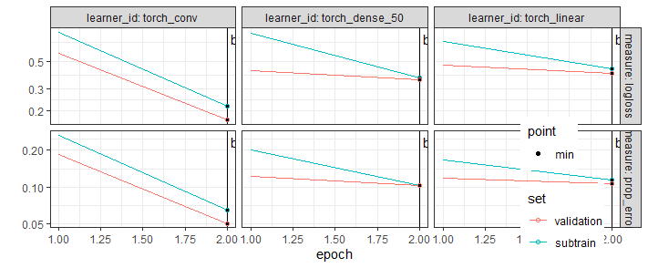
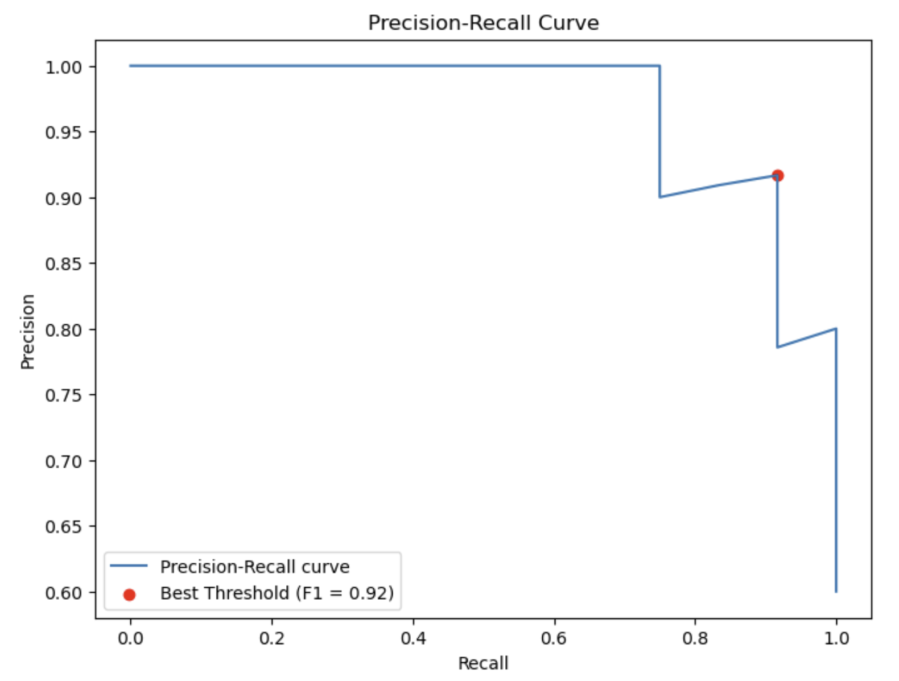

## Introduction
This project is the work I did during my two months summer research internship at the University of Sherbrooke - Department of Computer-Science.

---

## Week 1

- I began by redoing the [following code](https://tdhock.github.io/blog/2025/mlr3torch-conv/), only changing the number of epochs from 200 to 2 to make it run on my own computer.  
Results with two epochs :   

- I also learned about the precision-recall curve by redoing [this code](https://www.blog.trainindata.com/precision-recall-curves/) using the iris dataset (with the Iris-versicolor and the Iris-virginica). I first coded it in pyhton to follow the tutorial.

Here the best treshold is computed using the F1-score :  $\frac{2 \times \text{Precision} \times \text{Recall}}{\text{Precision} + \text{Recall}}$.

    Where Precision = $\frac{\text{True Positive}}{\text{True Positive} + \text{False Positive}}$ and Recall = $\frac{\text{True Positive}}{\text{True Positive} + \text{False Negative}}$ = True Positive Rate.
