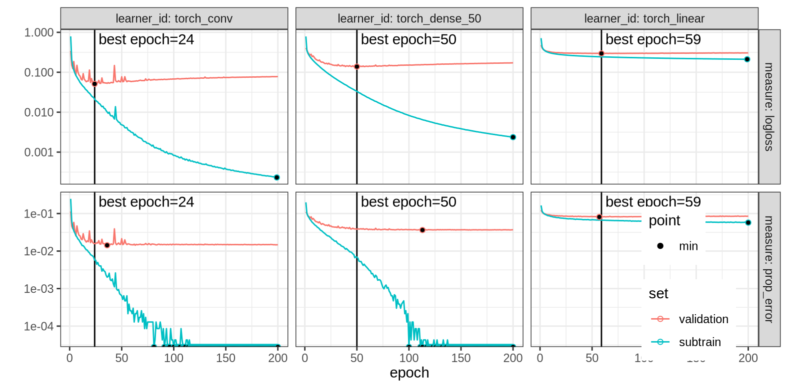
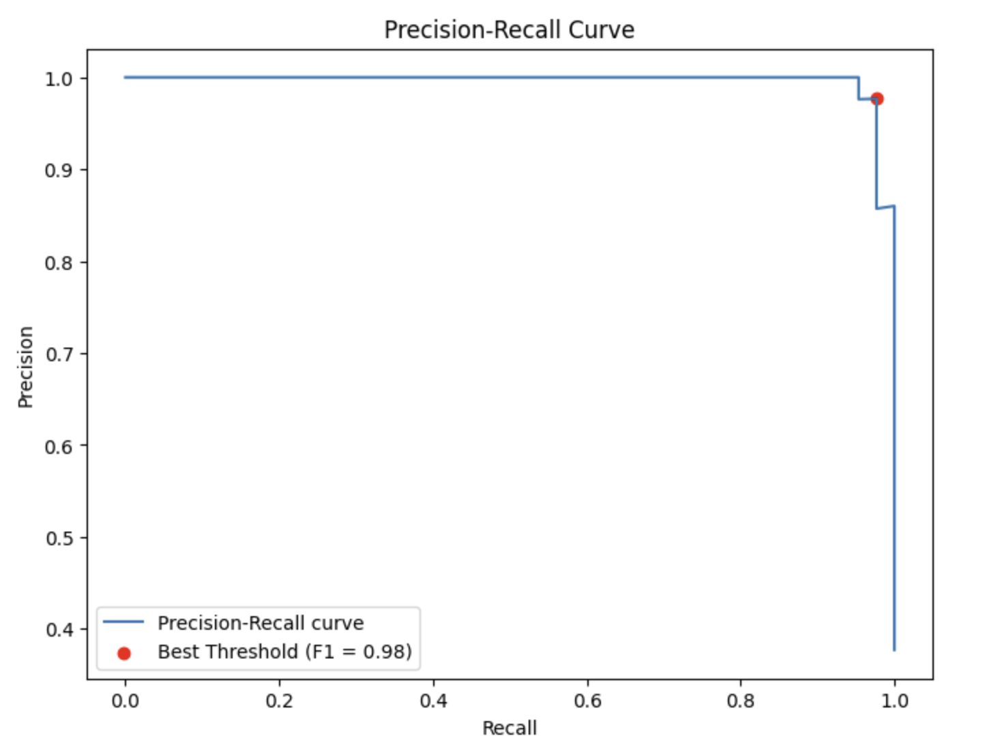
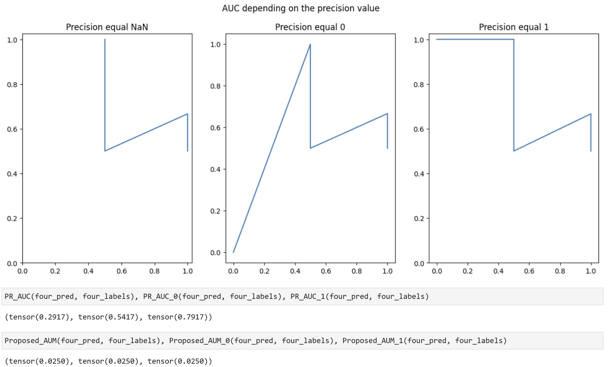

## Introduction
This project is the work I did during my two months summer research internship at the University of Sherbrooke - Department of Computer-Science.

---

## Lexicon
ROC : Receiver Operating Characteristic  
AUC : Area Under the Curve  
AUM : Area Under the Minimum  

PR : Precision-Recall

## Week 1

- I began by redoing the [following code](https://tdhock.github.io/blog/2025/mlr3torch-conv/), only changing the number of epochs from 200 to 2 to make it run on my own computer.  
Results with two epochs :   

  

  Then using an online Jupyterhub cluster I redid the experiment with the intended 200 epochs.      
  Here is the result with two hundred epochs :   

  

- To start learning about the PR curve and its differences with the ROC I redid [this](https://machinelearningmastery.com/roc-curves-and-precision-recall-curves-for-imbalanced-classification/) code and [this](https://machinelearningmastery.com/roc-curves-and-precision-recall-curves-for-classification-in-python/) code to better understand the Precision Recall and how to code them in pyhton.

- I also learned about the precision-recall curve by redoing [this code](https://www.blog.trainindata.com/precision-recall-curves/) using the iris dataset (with the Iris-versicolor and the Iris-virginica). I first coded it in [python](Learning-PR-Curves/PrecisionRecall-Iris.ipynb) to follow the tutorial. I then tried to do the same code in R.

  

Here the best treshold is computed using the F1-score :  $\frac{2 \times \text{Precision} \times \text{Recall}}{\text{Precision} + \text{Recall}}$.

Where Precision = $\frac{\text{True Positive}}{\text{True Positive} + \text{False Positive}}$ and Recall = $\frac{\text{True Positive}}{\text{True Positive} + \text{False Negative}}$ = True Positive Rate.

To go further I deleted some observations of the Iris versicolor to make an imbalanced dataset and see the consequences on the PR curve.  
To finish my analysis on this dataset I redid the PR curve with Versicolor against Setosa, Setosa against Virginica and then Setosa against Versicolor&Virginica (One Versus All).

- Lastly I did the [comparison between ROC and PR](Learning-PR-Curves/ROCvsPR-BreastCancer.ipynb) curves in python using a dataset a little bigger on breast cancer to see if the size of the dataset would impact the result.

  

  

## Week 2
- To continue my studies on the PR curve I used [this code](https://tdhock.github.io/blog/2024/auto-grad-overhead/) and transformed it from ROC to PR.  
  I searched how to handle the case where (TP+FP)=0 and how to define the precision in this case.
  I found [this](https://jamesmccaffrey.wordpress.com/2023/02/02/what-are-correct-values-for-precision-and-recall-when-the-denominators-are-zero/) blog post and [this](https://stats.stackexchange.com/questions/8025/what-are-correct-values-for-precision-and-recall-when-the-denominators-equal-0) forum post. I learned that if the precion's denominator is equal to zero then it means that the model always predicts class negative, similarly for the recall if its denominator is equal to zero then the data only has elements in the negative class.  
  The solution to these issues would be to return an error and set the value of the precision or the recall to NaN and not 0 to differentiate from when the models doesn't predict correctly any positive (no TP).   
    [Here](ROC-to-PR-Curve/PR.md) I looked at the differences between the two codes. I then redid the same thing [here](ROC-to-PR-Curve/PR.ipynb) using python and also the `precision_recall_curve` function in scikit learn. When studying the impact of the value chosen for the precision when its denominator is equal to zero I found that it greatly impacted the AUC however the AUM stayed the same.
  

  

## Week 3
After creating the PR AUM function I used it in the code I used at the very begining. [It](https://github.com/juruch/Internship-Sherbrooke/blob/main/PR-AUM/AUM-PR.R) gave me different figures, I then changed the measures to use `classif.prauc`.
